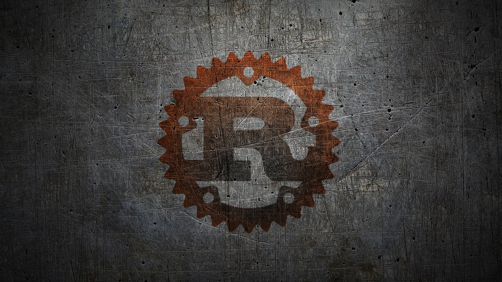

# Rust Book Experiment

Chapter 1. Getting Statrted

* [Getting Started](https://dev.to/danielmwandiki/getting-started-with-rust-2c3l)

* [Hello World](https://dev.to/danielmwandiki/hello-world-in-rust-2kbn)
  
Chapter 2. Programming a Guessing Game
* [Guessing Game](https://github.com/DanielMwandiki/Rust/tree/main/chapter_2/guessing_game)

Chapter 3. Common Programming Concepts
* [Variables](https://dev.to/danielmwandiki/variables-and-mutability-4700)
* [Data Types](https://dev.to/danielmwandiki/data-types-1dp3)
* [Functions](https://dev.to/danielmwandiki/functions-in-rust-2egi)
* [Control Flow](https://dev.to/danielmwandiki/conditions-and-control-flow-1cph)

Chapter 4. Understanding Ownership
* [Ownership](https://dev.to/danielmwandiki/rust-reference-and-ownership-31ic)

Chapter 5. Using Structs to Structure Related Data

Chapter 6. Enums and Pattern Matching

Chapter 7. Managing Growing Projects with Packages, Crates, and Modules

Chapter 8. Common Collections

Chapter 9. Error Handling

Chapter 10. Generic Types, Traits, and Lifetimes

Chapter 11. Writing Automated Tests

Chapter 12. An I/O Project: Building a Command Line Program

Chapter 13. Functional Language Features: Iterators and Closures

Chapter 14. More about Cargo and Crates.io

Chapter 15. Smart Pointers

Chapter 16. Fearless Concurrency

Chapter 17. Object Oriented Programming Features of Rust

Chapter 18. Patterns and Matching

Chapter 19. Advanced Features

Chapter 20. Final Project: Building a Multithreaded Web Server